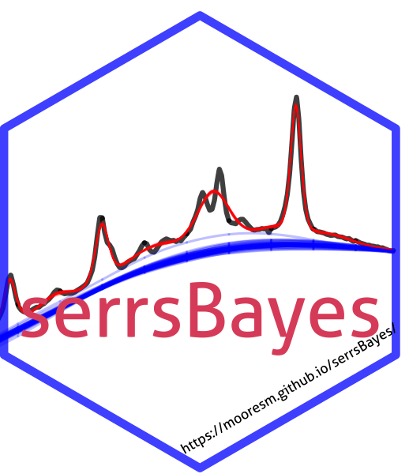
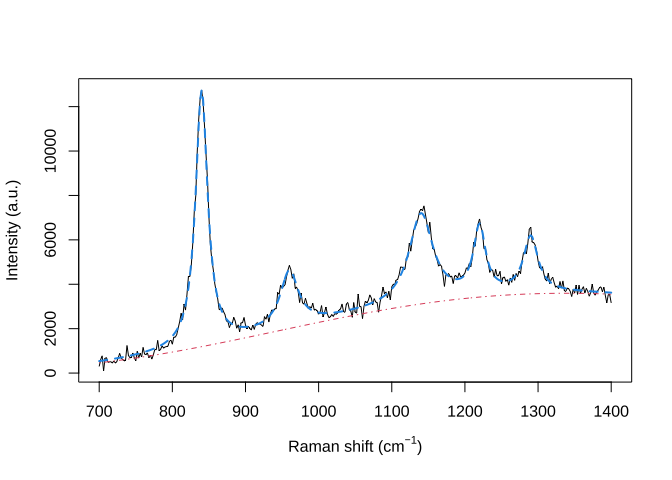
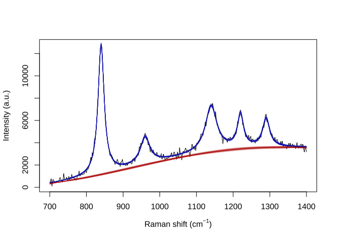

# serrsBayes

<!-- README.md is generated from README.Rmd. Please edit that file -->

[](https://cran.r-project.org/package=serrsBayes)
[](https://github.com/mooresm/serrsBayes/actions/workflows/R-CMD-check.yaml)
[](https://app.codecov.io/gh/mooresm/serrsBayes)
[](https://zenodo.org/badge/latestdoi/121410558)
[](https://github.com/r-hub/cranlogs.app)



`serrsBayes` provides model-based quantification of surface-enhanced
resonance Raman spectroscopy (SERRS) using sequential Monte Carlo (SMC)
algorithms. The details of the Bayesian model and informative priors are
provided in Moores et al. (2026) “[Bayesian modelling and quantification
of Raman
spectroscopy.](https://www.matrix-inst.org.au/wp_Matrix2016/wp-content/uploads/2025/2025_Pathiraja/MOORES.pdf),”
published in the *2025 MATRIX Annals, Part II* (Springer). Development
of this software was supported by the UK Engineering & Physical Sciences
Research Council (EPSRC) programme grant “[In Situ Nanoparticle
Assemblies for Healthcare Diagnostics and
Therapy](https://gtr.ukri.org/projects?ref=EP%2FL014165%2F1)” (ref:
EP/L014165/1).

# Installation Instructions

Stable releases, including binary packages for Windows & Mac OS, are
available from CRAN:

- <https://CRAN.R-project.org/package=serrsBayes>

``` r
install.packages("serrsBayes")
```

The current development version can be installed from GitHub:

``` r
devtools::install_github("mooresm/serrsBayes")
```

# Example Usage

To simulate a synthetic Raman spectrum with known parameters:

``` r
set.seed(1234)
library(serrsBayes)

wavenumbers <- seq(700,1400,by=2)
spectra <- matrix(nrow=1, ncol=length(wavenumbers))
peakLocations <- c(840,  960, 1140, 1220, 1290)
peakAmplitude <- c(11500, 2500, 4000, 3000, 2500)
peakScale <- c(10, 15, 20, 10, 12)
signature <- weightedLorentzian(peakLocations, peakScale, peakAmplitude, wavenumbers)
baseline <- 1000*cos(wavenumbers/200) + 2*wavenumbers
spectra[1,] <- signature + baseline + rnorm(length(wavenumbers),0,200)
plot(wavenumbers, spectra[1,], type='l', xlab=expression(paste("Raman shift (cm"^{-1}, ")")), ylab="Intensity (a.u.)")
lines(wavenumbers, baseline, col=2, lty=4)
lines(wavenumbers, baseline + signature, col=4, lty=2, lwd=2)
```



Fit the model using SMC:

``` r
lPriors <- list(scale.mu=log(11.6) - (0.4^2)/2, scale.sd=0.4, bl.smooth=10^11, bl.knots=50,
                 beta.mu=5000, beta.sd=5000, noise.sd=200, noise.nu=4)
tm <- system.time(result <- fitSpectraSMC(wavenumbers, spectra, peakLocations, lPriors))
```

Sample 200 particles from the posterior distribution:

``` r
print(tm)
#>    user  system elapsed 
#> 101.148   2.610 105.613
samp.idx <- sample.int(length(result$weights), 200, prob=result$weights)
plot(wavenumbers, spectra[1,], type='l', xlab=expression(paste("Raman shift (cm"^{-1}, ")")), ylab="Intensity (a.u.)")
for (pt in samp.idx) {
  bl.est <- result$basis %*% result$alpha[,1,pt]
  lines(wavenumbers, bl.est, col="#C3000009")
  lines(wavenumbers, bl.est + result$expFn[pt,], col="#0000C309")
}
```


