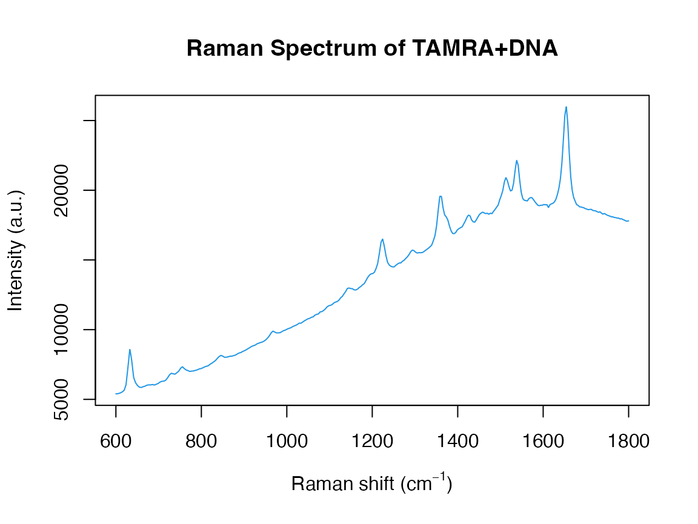
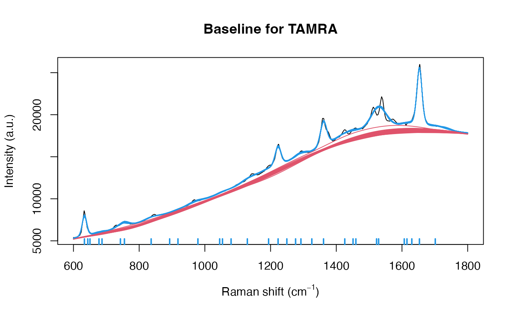
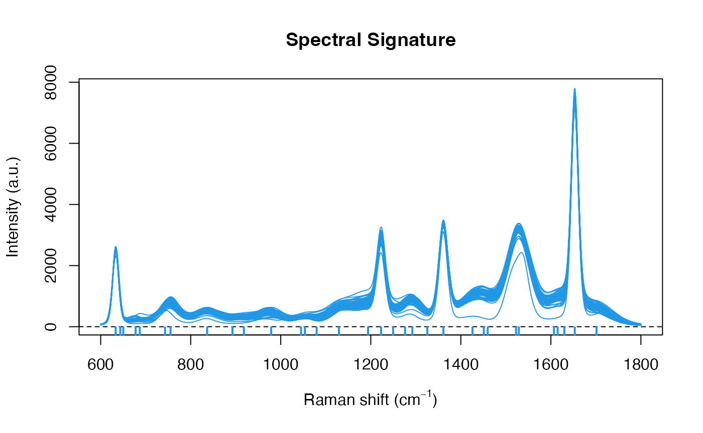

# Introducing serrsBayes

The R package **serrsBayes** uses a sequential Monte Carlo (SMC)
algorithm (Del Moral et al. 2006) to separate an observed spectrum into
3 components: the peaks $`s_i(\tilde\nu)`$; baseline
$`\xi_i(\tilde\nu)`$; and additive white noise
$`\epsilon_{i,j} \sim \mathcal{N}(0, \sigma^2_\epsilon)`$:
``` math
\mathbf{y}_i = \xi_i(\tilde\nu) + s_i(\tilde\nu) + \boldsymbol\epsilon_i
```
This is a type of *functional data analysis* (Ramsay et al. 2009), since
the discretised spectrum $`\mathbf{y}_i`$ is represented using latent
(unobserved), continuous functions. The background fluorescence
$`\xi_i(\tilde\nu)`$ is estimated using a penalised B-spline (Wood
2017), while the peaks can be modelled as Gaussian, Lorentzian, or
pseudo-Voigt functions.

The Voigt function is a *convolution* of a Gaussian and a Lorentzian:
$`f_V(\nu_j) = (f_G * f_L)(\nu_j)`$. It has an additional parameter
$`\eta_p`$ that equals 0 for pure Gaussian and 1 for Lorentzian:
``` math
s_i(\nu_j) = \sum_{p=1}^P A_{i,p} f_V(\nu_j ; \ell_p, \varphi_p, \eta_p) 
```
where $`A_{i,p}`$ is the *amplitude* of peak $`p`$; $`\ell_p`$ is the
peak *location*; and $`\varphi_p`$ is the *broadening*. The horizontal
axis of a Raman spectrum is measured in *wavenumbers*
$`\nu_j \in \Delta\tilde\nu`$, with units of inverse centimetres
(cm$`^{-1}`$). The vertical axis is measured in arbitrary units (a.u.),
since the *intensity* of the Raman signal depends on the properties of
the spectrometer. This functional model is explained further in our
paper, Moores et al. (2026).

### Data

This example of surface-enhanced Raman spectroscopy (SERS) was
originally published by Gracie et al. (2016):

\
[`library`](https://rdrr.io/r/base/library.html)`(`[`serrsBayes`](https://github.com/mooresm/serrsBayes)`)`\
[`data`](https://rdrr.io/r/utils/data.html)`(``"lsTamra"``, package ``=`` ``"serrsBayes"``)`\
`wavenumbers`` ``<-`` ``lsTamra``$``wavenumbers`\
`spectra`` ``<-`` ``lsTamra``$``spectra`\
[`plot`](https://rdrr.io/r/graphics/plot.default.html)`(``wavenumbers``, ``spectra``[``1``,``]``, type``=``'l'``, col``=``4``, main``=``"Raman Spectrum of TAMRA+DNA"``,`\
`     xlab``=`[`expression`](https://rdrr.io/r/base/expression.html)`(`[`paste`](https://rdrr.io/r/base/paste.html)`(``"Raman shift (cm"``^``{``-``1``}``, ``")"``)``)``, ylab``=``"Intensity (a.u.)"``)`



\
`nWL`` ``<-`` `[`length`](https://rdrr.io/r/base/length.html)`(``wavenumbers``)`

### Priors

We will use the same priors that were described in the paper (Moores et
al. 2026), including the TD-DFT peak locations from Watanabe et al.
(2005):

\
`peakLocations`` ``<-`` `[`c`](https://rdrr.io/r/base/c.html)`(``615``, ``631``, ``664``, ``673``, ``702``, ``705``, ``771``, ``819``, ``895``, ``923``, ``1014``,`\
`                   ``1047``, ``1049``, ``1084``, ``1125``, ``1175``, ``1192``, ``1273``, ``1291``, ``1307``, ``1351``, ``1388``, ``1390``,`\
`                   ``1419``, ``1458``, ``1505``, ``1530``, ``1577``, ``1601``, ``1615``, ``1652``, ``1716``)`\
`nPK`` ``<-`` `[`length`](https://rdrr.io/r/base/length.html)`(``peakLocations``)`\
`priors`` ``<-`` `[`list`](https://rdrr.io/r/base/list.html)`(``loc.mu``=``peakLocations``, loc.sd``=`[`rep`](https://rdrr.io/r/base/rep.html)`(``25``,``nPK``)``, scaG.mu``=`[`log`](https://rdrr.io/r/base/Log.html)`(``10``)`` ``-`` ``(``0.34``^``2``)``/``2``,`\
`               scaG.sd``=``0.34``, scaL.mu``=`[`log`](https://rdrr.io/r/base/Log.html)`(``10``)`` ``-`` ``(``0.4``^``2``)``/``2``, scaL.sd``=``0.4``, noise.nu``=``5``, noise.sd``=``20``,`\
`               bl.smooth``=``1``, bl.knots``=``121``, beta.exp``=``80``)`

### Computation

Now we run the SMC algorithm to fit the model:

\
[`data`](https://rdrr.io/r/utils/data.html)`(``"result"``, package ``=`` ``"serrsBayes"``)`\
`if``(``!`[`exists`](https://rdrr.io/r/base/exists.html)`(``"result"``)``)`` ``{`\
`  ``t1`` ``<-`` `[`Sys.time`](https://rdrr.io/r/base/Sys.time.html)`(``)`\
`  ``result`` ``<-`` `[`fitVoigtPeaksSMC`](https://mooresm.github.io/serrsBayes/reference/fitVoigtPeaksSMC.md)`(``wavenumbers``, ``spectra``, ``priors``, mcSteps``=``50``, minPart ``=`` ``7900``, npart ``=`` ``8000``)`\
`  ``result``$``time`` ``<-`` `[`Sys.time`](https://rdrr.io/r/base/Sys.time.html)`(``)`` ``-`` ``t1`\
`  `[`save`](https://rdrr.io/r/base/save.html)`(``result``, file``=``"Figure 2/result.rda"``)`\
`}`

The default values for the number of particles, Markov chain steps, and
learning rate can be somewhat conservative, depending on the
application. With 34 peaks and 2401 wavenumbers, fitting the model can
take a fair amount of time, even running in parallel with 8 CPU cores:

\
[`print`](https://rdrr.io/r/base/print.html)`(`[`paste`](https://rdrr.io/r/base/paste.html)`(`[`format`](https://rdrr.io/r/base/format.html)`(``result``$``time``,digits``=``4``)``,``" for"``,`[`length`](https://rdrr.io/r/base/length.html)`(``result``$``ess``)``,``"SMC iterations."``)``)`\
`#> [1] "3.553 hours  for 254 SMC iterations."`

The downside of choosing smaller values for these tuning parameters is
that you run the risk of the SMC collapsing. The quality of the particle
distribution deteriorates with each iteration, as measured by the
effective sample size (ESS):

\
[`plot.ts`](https://rdrr.io/r/stats/plot.ts.html)`(``result``$``ess``, ylab``=``"ESS"``, main``=``"Effective Sample Size"``,`\
`        xlab``=``"SMC iteration"``, ylim``=`[`c`](https://rdrr.io/r/base/c.html)`(``0``,`[`max`](https://rdrr.io/r/base/Extremes.html)`(``result``$``ess``)``)``)`\
[`abline`](https://rdrr.io/r/graphics/abline.html)`(``h``=`[`max`](https://rdrr.io/r/base/Extremes.html)`(``result``$``ess``)``/``2``, col``=``4``, lty``=``2``)`\
[`abline`](https://rdrr.io/r/graphics/abline.html)`(``h``=``0``,lty``=``2``)`\
[`plot.ts`](https://rdrr.io/r/stats/plot.ts.html)`(``result``$``accept``, ylab``=``"accept"``, main``=``"M-H Acceptance Rate"``,`\
`        xlab``=``"SMC iteration"``, ylim``=`[`c`](https://rdrr.io/r/base/c.html)`(``0``,`[`max`](https://rdrr.io/r/base/Extremes.html)`(``result``$``accept``)``)``)`\
[`abline`](https://rdrr.io/r/graphics/abline.html)`(``h``=``0.234``, col``=``4``, lty``=``2``)`\
[`abline`](https://rdrr.io/r/graphics/abline.html)`(``h``=``0``,lty``=``2``)`\
[`plot.ts`](https://rdrr.io/r/stats/plot.ts.html)`(``result``$``times``/``60``, ylab``=``"time (min)"``, main``=``"Elapsed Time"``, xlab``=``"SMC iteration"``)`\
[`plot.ts`](https://rdrr.io/r/stats/plot.ts.html)`(``result``$``kappa``, ylab``=`[`expression`](https://rdrr.io/r/base/expression.html)`(``kappa``)``, main``=``"Likelihood Tempering"``,`\
`        xlab``=``"SMC iteration"``)`\
[`abline`](https://rdrr.io/r/graphics/abline.html)`(``h``=``0``,lty``=``2``)`\
[`abline`](https://rdrr.io/r/graphics/abline.html)`(``h``=``1``,lty``=``3``,col``=``4``)`


If SMC collapses, the best solution is to increase the number of
particles and run it again. Thus, choosing a conservative number to
begin with is a sensible strategy. With 8000 particles and a maximum of
60 MCMC steps per SMC iteration, we can see from the above plots that
the algorithm has converged to the target distribution. More detailed
convergence diagnostics can be obtained from the genealogical history of
the particles Lee and Whiteley (2015), but this is not yet implemented
in the R package.

### Posterior Inference

A subsample of particles can be used to plot the posterior distribution
of the baseline and peaks:

\
`samp.idx`` ``<-`` `[`sample.int`](https://rdrr.io/r/base/sample.html)`(`[`length`](https://rdrr.io/r/base/length.html)`(``result``$``weights``)``, ``50``, prob``=``result``$``weights``)`\
`samp.mat`` ``<-`` ``resid.mat`` ``<-`` `[`matrix`](https://rdrr.io/r/base/matrix.html)`(``0``,nrow``=`[`length`](https://rdrr.io/r/base/length.html)`(``samp.idx``)``, ncol``=``nWL``)`\
`samp.sigi`` ``<-`` ``samp.lambda`` ``<-`` `[`numeric`](https://rdrr.io/r/base/numeric.html)`(``length``=`[`nrow`](https://rdrr.io/r/base/nrow.html)`(``samp.mat``)``)`\
`samp.loc`` ``<-`` `[`colMeans`](https://rdrr.io/pkg/Matrix/man/colSums-methods.html)`(``result``$``location``)`\
`spectra`` ``<-`` `[`as.matrix`](https://rdrr.io/r/base/matrix.html)`(``spectra``)`\
[`plot`](https://rdrr.io/r/graphics/plot.default.html)`(``wavenumbers``, ``spectra``[``1``,``]``, type``=``'l'``, xlab``=`[`expression`](https://rdrr.io/r/base/expression.html)`(`[`paste`](https://rdrr.io/r/base/paste.html)`(``"Raman shift (cm"``^``{``-``1``}``, ``")"``)``)``, ylab``=``"Intensity (a.u.)"``)`\
`for`` ``(``pt`` ``in`` ``1``:`[`length`](https://rdrr.io/r/base/length.html)`(``samp.idx``)``)`` ``{`\
`  ``k`` ``<-`` ``samp.idx``[``pt``]`\
`  ``samp.mat``[``pt``,``]`` ``<-`` `[`mixedVoigt`](https://mooresm.github.io/serrsBayes/reference/mixedVoigt.md)`(``result``$``location``[``k``,``]``, ``result``$``scale_G``[``k``,``]``,`\
`                              ``result``$``scale_L``[``k``,``]``, ``result``$``beta``[``k``,``]``, ``wavenumbers``)`\
`  ``samp.sigi``[``pt``]`` ``<-`` ``result``$``sigma``[``k``]`\
`  ``samp.lambda``[``pt``]`` ``<-`` ``result``$``lambda``[``k``]`\
`  `\
`  ``Obsi`` ``<-`` ``spectra``[``1``,``]`` ``-`` ``samp.mat``[``pt``,``]`\
`  ``g0_Cal`` ``<-`` `[`length`](https://rdrr.io/r/base/length.html)`(``Obsi``)`` ``*`` ``samp.lambda``[``pt``]`` ``*`` ``result``$``priors``$``bl.precision`\
`  ``gi_Cal`` ``<-`` `[`crossprod`](https://rdrr.io/pkg/Matrix/man/matmult-methods.html)`(``result``$``priors``$``bl.basis``)`` ``+`` ``g0_Cal`\
`  ``mi_Cal`` ``<-`` `[`as.vector`](https://rdrr.io/r/base/vector.html)`(`[`solve`](https://rdrr.io/pkg/Matrix/man/solve-methods.html)`(``gi_Cal``, `[`crossprod`](https://rdrr.io/pkg/Matrix/man/matmult-methods.html)`(``result``$``priors``$``bl.basis``, ``Obsi``)``)``)`\
\
`  ``bl.est`` ``<-`` ``result``$``priors``$``bl.basis`` `[`%*%`](https://rdrr.io/r/base/matmult.html)` ``mi_Cal`` ``# smoothed residuals = estimated basline`\
`  `[`lines`](https://rdrr.io/r/graphics/lines.html)`(``wavenumbers``, ``bl.est``, col``=``2``)`\
`  `[`lines`](https://rdrr.io/r/graphics/lines.html)`(``wavenumbers``, ``bl.est`` ``+`` ``samp.mat``[``pt``,``]``, col``=``4``)`\
`  ``resid.mat``[``pt``,``]`` ``<-`` ``Obsi`` ``-`` ``bl.est``[``,``1``]`\
`}`\
[`title`](https://rdrr.io/r/graphics/title.html)`(``main``=``"Baseline for TAMRA"``)`\
[`rug`](https://rdrr.io/r/graphics/rug.html)`(``samp.loc``, col``=``4``,lwd``=``2``)`\
\
[`plot`](https://rdrr.io/r/graphics/plot.default.html)`(`[`range`](https://rdrr.io/r/base/range.html)`(``wavenumbers``)``, `[`range`](https://rdrr.io/r/base/range.html)`(``samp.mat``)``, type``=``'n'``, xlab``=`[`expression`](https://rdrr.io/r/base/expression.html)`(`[`paste`](https://rdrr.io/r/base/paste.html)`(``"Raman shift (cm"``^``{``-``1``}``, ``")"``)``)``, ylab``=``"Intensity (a.u.)"``)`\
[`abline`](https://rdrr.io/r/graphics/abline.html)`(``h``=``0``,lty``=``2``)`\
`for`` ``(``pt`` ``in`` ``1``:`[`length`](https://rdrr.io/r/base/length.html)`(``samp.idx``)``)`` ``{`\
`  `[`lines`](https://rdrr.io/r/graphics/lines.html)`(``wavenumbers``, ``samp.mat``[``pt``,``]``, col``=``4``)`\
`}`\
[`title`](https://rdrr.io/r/graphics/title.html)`(``main``=``"Spectral Signature"``)`\
[`rug`](https://rdrr.io/r/graphics/rug.html)`(``samp.loc``,col``=``4``,lwd``=``2``)`



Notice that the uncertainty in the baseline is greatest where the peaks
are bunched close together, which is exactly what we would expect. This
is also reflected in uncertainty of the spectral signature.

We can compute the Voigt parameters and the full width at half maximum
(FWHM) for each peak:

\
`result``$``voigt`` ``<-`` ``result``$``FWHM`` ``<-`` `[`matrix`](https://rdrr.io/r/base/matrix.html)`(``nrow``=`[`nrow`](https://rdrr.io/r/base/nrow.html)`(``result``$``beta``)``, ncol``=`[`ncol`](https://rdrr.io/r/base/nrow.html)`(``result``$``beta``)``)`\
`for`` ``(``k`` ``in`` ``1``:`[`nrow`](https://rdrr.io/r/base/nrow.html)`(``result``$``beta``)``)`` ``{`\
`  ``result``$``voigt``[``k``,``]`` ``<-`` `[`getVoigtParam`](https://mooresm.github.io/serrsBayes/reference/getVoigtParam.md)`(``result``$``scale_G``[``k``,``]``, ``result``$``scale_L``[``k``,``]``)`\
`  ``f_G`` ``<-`` ``result``$``scale_G``[``k``,``]`\
`  ``f_L`` ``<-`` ``result``$``scale_L``[``k``,``]`\
`  ``result``$``FWHM``[``k``,``]`` ``<-`` ``0.5346``*``f_L`` ``+`` `[`sqrt`](https://rdrr.io/r/base/MathFun.html)`(``0.2166``*``f_L``^``2`` ``+`` ``f_G``^``2``)`\
`}`

Finally, display the lower and upper 95% highest posterior density (HPD)
intervals for the parameters of each peak:

| Location (cm-1) |          Amplitude |    FWHM (cm-1) |          Voigt |
|----------------:|-------------------:|---------------:|---------------:|
|   \[ 633; 634\] | \[2333.5; 2549.2\] |  \[ 8.8; 9.7\] | \[0.32; 0.40\] |
|   \[ 637; 650\] |     \[ 4.3; 28.2\] | \[24.6; 30.1\] | \[0.47; 0.69\] |
|   \[ 643; 661\] |    \[ 23.5; 80.4\] | \[28.8; 36.2\] | \[0.30; 0.38\] |
|   \[ 665; 691\] |      \[ 0.2; 1.0\] | \[21.2; 27.4\] | \[0.46; 0.57\] |
|   \[ 677; 695\] |   \[ 82.1; 273.8\] | \[25.0; 31.3\] | \[0.52; 0.71\] |
|   \[ 736; 751\] |  \[ 118.9; 243.6\] | \[33.7; 42.1\] | \[0.44; 0.59\] |
|   \[ 752; 758\] |  \[ 378.0; 747.3\] | \[30.6; 45.5\] | \[0.61; 0.77\] |
|   \[ 833; 841\] |  \[ 313.7; 513.2\] | \[34.4; 38.6\] | \[0.25; 0.34\] |
|   \[ 881; 905\] |    \[ 10.2; 21.1\] | \[20.4; 29.5\] | \[0.18; 0.27\] |
|   \[ 902; 938\] |  \[ 140.3; 338.2\] | \[43.1; 57.6\] | \[0.21; 0.33\] |
|   \[ 968; 991\] |  \[ 169.8; 475.4\] | \[25.5; 36.2\] | \[0.23; 0.34\] |
|  \[1036; 1052\] |     \[ 3.9; 18.6\] | \[19.2; 24.1\] | \[0.47; 0.70\] |
|  \[1048; 1058\] |  \[ 167.4; 310.7\] | \[34.7; 45.7\] | \[0.34; 0.49\] |
|  \[1061; 1095\] |    \[ 25.0; 62.3\] | \[32.1; 43.9\] | \[0.37; 0.61\] |
|  \[1123; 1137\] |  \[ 266.8; 547.0\] | \[23.8; 38.1\] | \[0.11; 0.18\] |
|  \[1182; 1204\] |  \[ 471.8; 899.2\] | \[54.4; 65.9\] | \[0.30; 0.42\] |
|  \[1223; 1223\] | \[2184.5; 2367.0\] | \[11.8; 13.2\] | \[0.35; 0.44\] |
|  \[1240; 1259\] |    \[ 10.7; 76.6\] | \[18.0; 23.4\] | \[0.28; 0.42\] |
|  \[1271; 1283\] |     \[ 7.4; 45.8\] | \[28.5; 34.9\] | \[0.48; 0.61\] |
|  \[1289; 1298\] |  \[ 441.8; 834.0\] | \[27.8; 35.4\] | \[0.28; 0.43\] |
|  \[1305; 1341\] |      \[ 0.6; 1.8\] | \[26.3; 37.8\] | \[0.24; 0.40\] |
|  \[1361; 1362\] | \[3022.3; 3191.4\] | \[14.4; 15.7\] | \[0.45; 0.50\] |
|  \[1421; 1431\] |  \[ 616.1; 931.1\] | \[39.0; 48.9\] | \[0.22; 0.30\] |
|  \[1443; 1457\] |   \[ 29.9; 112.8\] | \[24.6; 33.3\] | \[0.17; 0.25\] |
|  \[1455; 1467\] |   \[ 83.8; 528.4\] | \[28.2; 37.9\] | \[0.39; 0.51\] |
|  \[1513; 1528\] |    \[ 2.9; 118.6\] | \[22.8; 27.1\] | \[0.24; 0.36\] |
|  \[1527; 1531\] | \[2795.0; 3249.2\] | \[33.2; 37.9\] | \[0.34; 0.49\] |
|  \[1599; 1614\] |     \[ 4.7; 26.7\] | \[26.2; 35.9\] | \[0.24; 0.38\] |
|  \[1609; 1622\] |  \[ 391.7; 835.6\] | \[31.2; 40.8\] | \[0.22; 0.31\] |
|  \[1620; 1644\] |      \[ 1.4; 3.5\] | \[47.7; 54.5\] | \[0.15; 0.20\] |
|  \[1653; 1653\] | \[6735.3; 6930.2\] | \[10.8; 11.4\] | \[0.36; 0.41\] |
|  \[1693; 1710\] |  \[ 339.2; 684.2\] | \[40.8; 53.9\] | \[0.34; 0.45\] |

95% highest posterior density intervals for pseudo-Voigt peaks {.table}

## References

Del Moral, Pierre, Arnaud Doucet, and Ajay Jasra. 2006. “Sequential
Monte Carlo Samplers.” *J. R. Stat. Soc. Ser. B* 68 (3): 411–36.
<https://doi.org/10.1111/j.1467-9868.2006.00553.x>.

Gracie, K., M. Moores, W. E. Smith, et al. 2016. “Preferential
Attachment of Specific Fluorescent Dyes and Dye Labelled DNA Sequences
in a SERS Multiplex.” *Anal. Chem.* 88 (2): 1147–53.
<https://doi.org/10.1021/acs.analchem.5b02776>.

Jacob, Pierre E., Lawrence M. Murray, and Sylvain Rubenthaler. 2015.
“Path Storage in the Particle Filter.” *Stat. Comput.* 25 (2): 487–96.
<https://doi.org/10.1007/s11222-013-9445-x>.

Lee, Anthony, and Nick Whiteley. 2015. “Variance Estimation in the
Particle Filter.” *arXiv Preprint arXiv:1509.00394 \[Stat.CO\]*.
<https://arxiv.org/abs/1509.00394>.

Moores, Matthew, Kirsten Gracie, Jake Carson, Karen Faulds, Duncan
Graham, and Mark Girolami. 2026. “Bayesian Modelling and Quantification
of Raman Spectroscopy.” In *2025 MATRIX Annals. Part II*, edited by D.
R. Wood, A. M. Etheridge, J. de Gier, and N. Joshi, vol. 10. MATRIX Book
Ser. Springer. <https://doi.org/10.48550/arXiv.1604.07299>.

Ramsay, Jim O., Giles Hooker, and Spencer Graves. 2009. *Functional Data
Analysis with R and MATLAB*. Use r! Springer.
<https://doi.org/10.1007/978-0-387-98185-7>.

Watanabe, Hiroyuki, Norihiko Hayazawa, Yasushi Inouye, and Satoshi
Kawata. 2005. “DFT Vibrational Calculations of Rhodamine 6G Adsorbed on
Silver: Analysis of Tip-Enhanced Raman Spectroscopy.” *J. Phys. Chem. B*
109 (11): 5012–20. <https://doi.org/10.1021/jp045771u>.

Wood, Simon N. 2017. *Generalized Additive Models: An Introduction with
r*. 2nd ed. Chapman & Hall/CRC Press.
