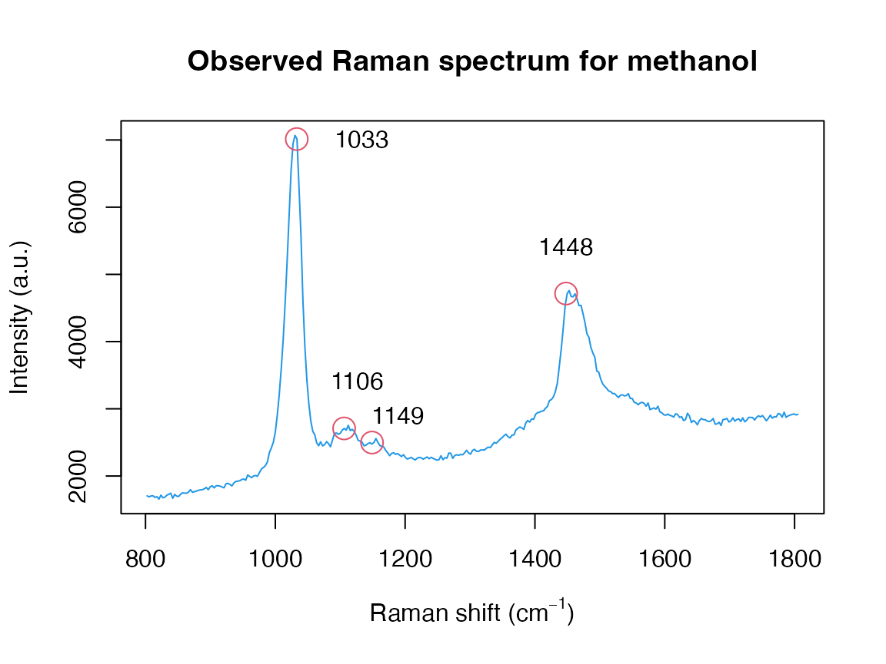
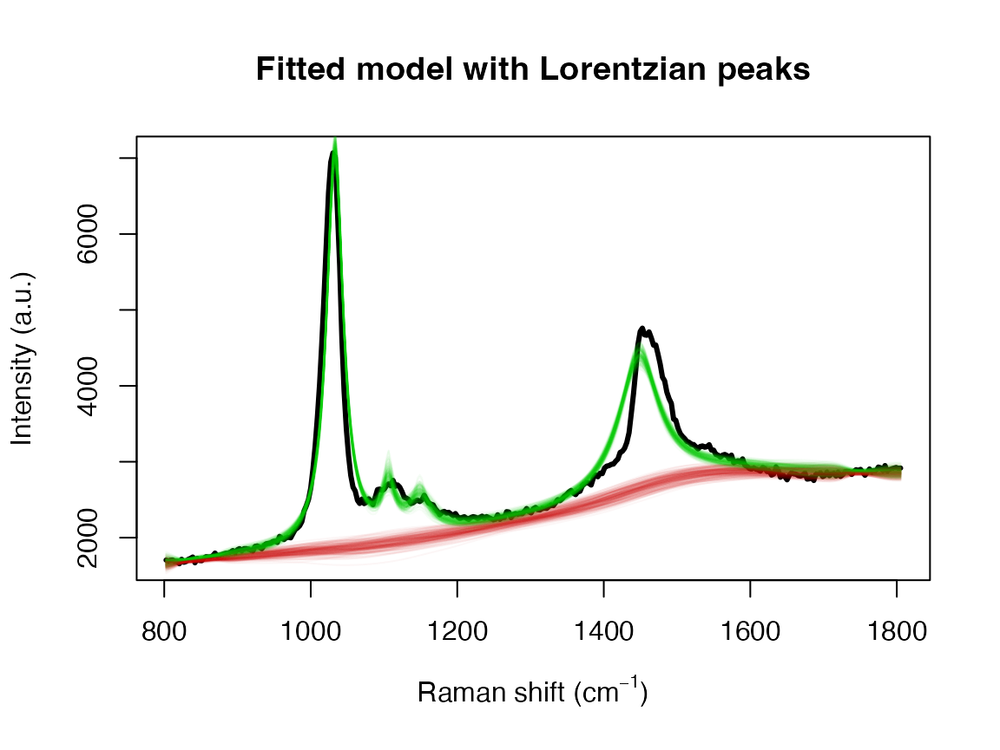
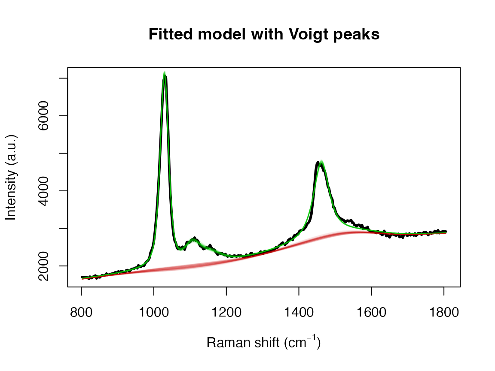
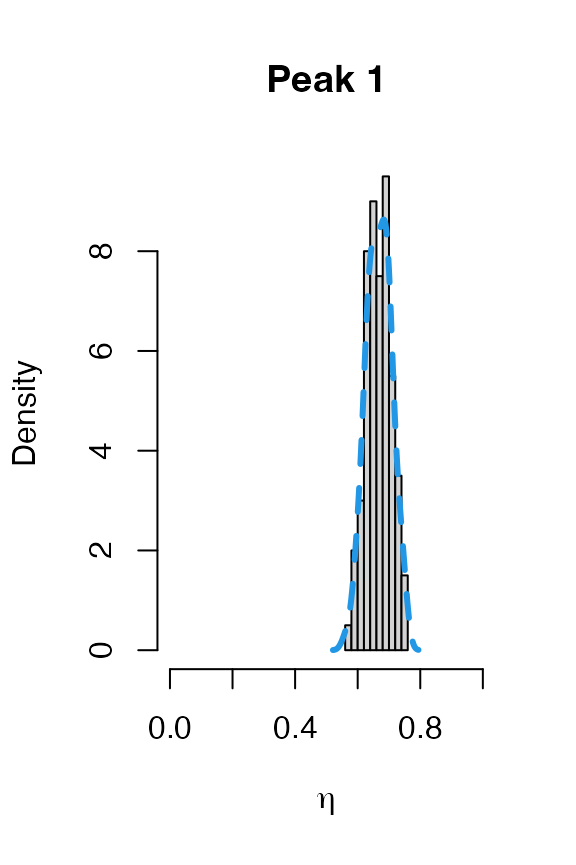
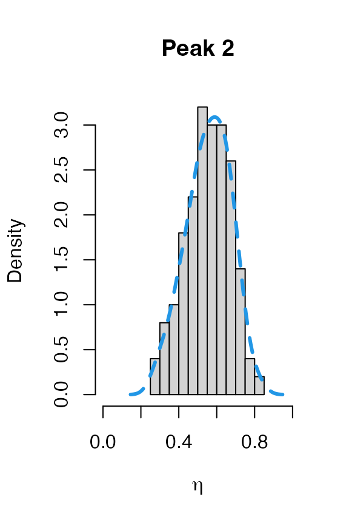
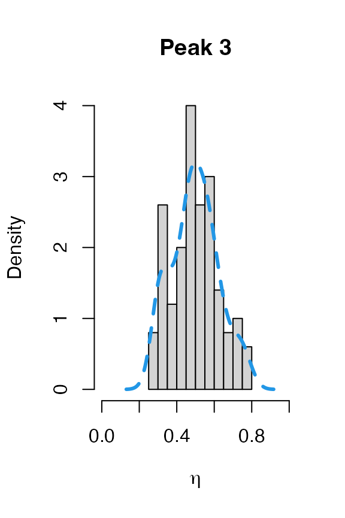
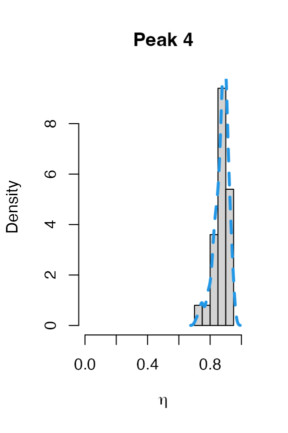
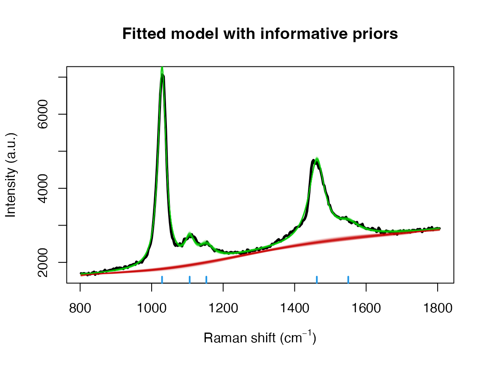

# Methanol example

There are 3 R functions available in the package **serrsBayes** for
model-based, statistical analysis of spectroscopy:

- `fitSpectraMCMC`
- `fitSpectraSMC`
- `fitVoigtPeaksSMC`

This vignette will provide recommendations for choosing which function
to use for a given purpose. As an example, let’s say I wanted to fit a
Raman spectrum of methanol. With a quick Google search, I find that
there should be 4 peaks located at wavenumbers 1033 (C-O stretching),
1106 (CH3 rocking), 1149 (CH3 bending), and 1448 cm$`^{-1}`$. However,
we know that these peaks can shift slightly due to differences in
temperature, pressure, spectrometer calibration, etc. My sample is in
the liquid phase, so these peaks will not be exactly Gaussian or
Lorentzian, but somewhere in the middle. On the other hand, I don’t want
to wait for hours for SMC to finish running.

The first point to emphasise is that `fitSpectraMCMC` should *not* be
used for real data. It exists mainly to illustrate the differences
between MCMC and SMC algorithms, so is only of interest to computational
statisticians.

`fitSpectraSMC` is the fastest method, but can also be difficult to
tune. You need to choose either Lorentzian or Gaussian broadening
functions. You also need to use fixed peak locations and the results are
sensitive to the choice of `priors$bl.smooth`, however if you manage to
get it working for your data then there is no real reason to use
`fitVoigtPeaksSMC`.

The main differences in `fitVoigtPeaksSMC` are as follows:

- There are 2 scale parameters, $`\psi_G`$ and $`\psi_L`$, that control
  the full-width at half-maximum (FWHM) of the peaks. The broadening
  profile is a mixture of Gaussian and Lorentzian, also known as a
  [pseudo-Voigt
  function](https://en.wikipedia.org/wiki/Voigt_profile#Numeric_approximations).
- The peak locations are not fixed. Instead, they are estimated as
  parameters of the model. This means that you need to supply
  informative prior distributions for the peak locations, `loc.mu`
  (mean) and `loc.sd` (standard deviation), in wavenumbers
  $`\left(\mathrm{cm}^{-1}\right)`$.
- The underlying SMC algorithm works differently. The main effect of
  this is that you should set `priors$bl.smooth = 1` if you are using
  `fitVoigtPeaksSMC`, instead of `priors$bl.smooth=10^11` or something
  like that. The baseline estimation is more robust and easier to tune
  for “difficult” spectra.
- You do not need to set a prior for the amplitudes of the peaks
  (`beta.mu` and `beta.sd`). If you leave it out, then a uniform prior
  will be used by default. However, you can also set informative priors
  for the amplitude of each peak in the spectrum if that information is
  available.

### Raw Data

The first step is always to read in the spectrum and plot it. Normally I
would use the R package **hyperSpec** for this, but the data that we are
going to use is included in the R package **serrsBayes**:

\
[`library`](https://rdrr.io/r/base/library.html)`(`[`serrsBayes`](https://github.com/mooresm/serrsBayes)`)`\
[`data`](https://rdrr.io/r/utils/data.html)`(``"methanol"``, package ``=`` ``"serrsBayes"``)`\
`wavenumbers`` ``<-`` ``methanol``$``wavenumbers`\
`spectra`` ``<-`` ``methanol``$``spectra`\
\
`peakLocations`` ``<-`` `[`c`](https://rdrr.io/r/base/c.html)`(``1033``, ``1106``, ``1149``, ``1448``)`\
`nPK`` ``<-`` `[`length`](https://rdrr.io/r/base/length.html)`(``peakLocations``)`\
`pkIdx`` ``<-`` `[`numeric`](https://rdrr.io/r/base/numeric.html)`(``nPK``)`\
`for`` ``(``i`` ``in`` ``1``:``nPK``)`` ``{`\
`  ``pkIdx``[``i``]`` ``<-`` `[`which.min`](https://rdrr.io/r/base/which.min.html)`(``wavenumbers`` ``<`` ``peakLocations``[``i``]``)`\
`}`\
`nWL`` ``<-`` `[`length`](https://rdrr.io/r/base/length.html)`(``wavenumbers``)`\
[`plot`](https://rdrr.io/r/graphics/plot.default.html)`(``wavenumbers``, ``spectra``[``1``,``]``, type``=``'l'``, col``=``4``,`\
`     xlab``=`[`expression`](https://rdrr.io/r/base/expression.html)`(`[`paste`](https://rdrr.io/r/base/paste.html)`(``"Raman shift (cm"``^``{``-``1``}``, ``")"``)``)``, ylab``=``"Intensity (a.u.)"``, main``=``"Observed Raman spectrum for methanol"``)`\
[`points`](https://rdrr.io/r/graphics/points.html)`(``peakLocations``, ``spectra``[``1``,``pkIdx``]``, cex``=``2``, col``=``2``)`\
[`text`](https://rdrr.io/r/graphics/text.html)`(``peakLocations`` ``+`` `[`c`](https://rdrr.io/r/base/c.html)`(``100``,``20``,``40``,``0``)``, ``spectra``[``1``,``pkIdx``]`` ``+`` `[`c`](https://rdrr.io/r/base/c.html)`(``0``,``700``,``400``,``700``)``, labels``=``peakLocations``)`

### fitSpectraSMC

We can use exactly the same priors as given in the package README:

\
`lPriors`` ``<-`` `[`list`](https://rdrr.io/r/base/list.html)`(``scale.mu``=`[`log`](https://rdrr.io/r/base/Log.html)`(``11.6``)`` ``-`` ``(``0.4``^``2``)``/``2``, scale.sd``=``0.4``, bl.smooth``=``10``^``11``, bl.knots``=``50``,`\
`                 beta.mu``=``5000``, beta.sd``=``5000``, noise.sd``=``200``, noise.nu``=``4``)`\
`tm`` ``<-`` `[`system.time`](https://rdrr.io/r/base/system.time.html)`(``result`` ``<-`` `[`fitSpectraSMC`](https://mooresm.github.io/serrsBayes/reference/fitSpectraSMC.md)`(``wavenumbers``, ``spectra``, ``peakLocations``, ``lPriors``)``)`

\
[`print`](https://rdrr.io/r/base/print.html)`(`[`paste`](https://rdrr.io/r/base/paste.html)`(``tm``[``"elapsed"``]``/``60``, ``"minutes"``)``)`

    ## [1] "54.2650666666667 minutes"

We can see there is a problem with the model fit:

\
`samp.idx`` ``<-`` `[`sample.int`](https://rdrr.io/r/base/sample.html)`(`[`length`](https://rdrr.io/r/base/length.html)`(``result``$``weights``)``, ``200``, prob``=``result``$``weights``)`\
[`plot`](https://rdrr.io/r/graphics/plot.default.html)`(``wavenumbers``, ``spectra``[``1``,``]``, type``=``'l'``, lwd``=``3``,`\
`     xlab``=`[`expression`](https://rdrr.io/r/base/expression.html)`(`[`paste`](https://rdrr.io/r/base/paste.html)`(``"Raman shift (cm"``^``{``-``1``}``, ``")"``)``)``, ylab``=``"Intensity (a.u.)"``, main``=``"Fitted model with Lorentzian peaks"``)`\
`for`` ``(``pt`` ``in`` ``samp.idx``)`` ``{`\
`  ``bl.est`` ``<-`` ``result``$``basis`` `[`%*%`](https://rdrr.io/r/base/matmult.html)` ``result``$``alpha``[``,``1``,``pt``]`\
`  `[`lines`](https://rdrr.io/r/graphics/lines.html)`(``wavenumbers``, ``bl.est``, col``=``"#C3000009"``)`\
`  `[`lines`](https://rdrr.io/r/graphics/lines.html)`(``wavenumbers``, ``bl.est`` ``+`` ``result``$``expFn``[``pt``,``]``, col``=``"#00C30009"``)`\
`}`

Adjusting the priors is not going to fix this. The underlying issue is
that the peak location of 1448 cm$`^{-1}`$ doesn’t match our observed
data. Even a small difference in the location of one of the peaks can
adversely effect the entire model fit. This is the kind of issue that
the function `fitVoigtPeaksSMC` is designed to handle.

### fitVoigtPeaksSMC

The priors here are very similar to what we used for TAMRA in [the other
vignette](https://mooresm.github.io/serrsBayes/articles/Introduction.html).
However, we don’t need as many `bl.knots` because we have a narrower
range of wavenumbers. Instead, we will use `bl.knots = 50`, the same as
what we used for `fitSpectraSMC` above.

\
`lPriors2`` ``<-`` `[`list`](https://rdrr.io/r/base/list.html)`(``loc.mu``=``peakLocations``, loc.sd``=`[`rep`](https://rdrr.io/r/base/rep.html)`(``50``,``nPK``)``, scaG.mu``=`[`log`](https://rdrr.io/r/base/Log.html)`(``16.47``)`` ``-`` ``(``0.34``^``2``)``/``2``,`\
`                 scaG.sd``=``0.34``, scaL.mu``=`[`log`](https://rdrr.io/r/base/Log.html)`(``25.27``)`` ``-`` ``(``0.4``^``2``)``/``2``, scaL.sd``=``0.4``, noise.nu``=``5``,`\
`                 noise.sd``=``50``, bl.smooth``=``1``, bl.knots``=``50``)`\
[`data`](https://rdrr.io/r/utils/data.html)`(``"result2"``, package ``=`` ``"serrsBayes"``)`\
`if``(``!`[`exists`](https://rdrr.io/r/base/exists.html)`(``"result2"``)``)`` ``{`\
`  ``tm2`` ``<-`` `[`Sys.time`](https://rdrr.io/r/base/Sys.time.html)`(``)`\
`  ``result2`` ``<-`` `[`fitVoigtPeaksSMC`](https://mooresm.github.io/serrsBayes/reference/fitVoigtPeaksSMC.md)`(``wavenumbers``, ``spectra``, ``lPriors2``, npart``=``3000``, rate``=``0.499``,mcSteps``=``50``)`\
`  ``result2``$``time`` ``<-`` `[`Sys.time`](https://rdrr.io/r/base/Sys.time.html)`(``)`` ``-`` ``tm2`\
`  `[`save`](https://rdrr.io/r/base/save.html)`(``result2``, file``=``"Figure 2/result2.rda"``)`\
`}`

`fitVoigtPeaksSMC` takes more than twice as long to fit the model, due
to estimating the additional parameters. However, we obtain a much
better fit to the observed spectrum:

\
[`print`](https://rdrr.io/r/base/print.html)`(`[`paste`](https://rdrr.io/r/base/paste.html)`(`[`format`](https://rdrr.io/r/base/format.html)`(``result2``$``time``)``, ``"for"``,`[`length`](https://rdrr.io/r/base/length.html)`(``result2``$``ess``)``,``"SMC iterations."``)``)`

    ## [1] "7.083923 mins for 19 SMC iterations."

\
`samp.idx`` ``<-`` ``1``:`[`nrow`](https://rdrr.io/r/base/nrow.html)`(``result2``$``location``)`\
[`plot`](https://rdrr.io/r/graphics/plot.default.html)`(``wavenumbers``, ``spectra``[``1``,``]``, type``=``'l'``, lwd``=``3``,`\
`     xlab``=`[`expression`](https://rdrr.io/r/base/expression.html)`(`[`paste`](https://rdrr.io/r/base/paste.html)`(``"Raman shift (cm"``^``{``-``1``}``, ``")"``)``)``, ylab``=``"Intensity (a.u.)"``, main``=``"Fitted model with Voigt peaks"``)`\
`samp.mat`` ``<-`` ``resid.mat`` ``<-`` `[`matrix`](https://rdrr.io/r/base/matrix.html)`(``0``,nrow``=`[`length`](https://rdrr.io/r/base/length.html)`(``samp.idx``)``, ncol``=``nWL``)`\
`samp.sigi`` ``<-`` ``samp.lambda`` ``<-`` `[`numeric`](https://rdrr.io/r/base/numeric.html)`(``length``=`[`nrow`](https://rdrr.io/r/base/nrow.html)`(``samp.mat``)``)`\
`for`` ``(``pt`` ``in`` ``1``:`[`length`](https://rdrr.io/r/base/length.html)`(``samp.idx``)``)`` ``{`\
`  ``k`` ``<-`` ``samp.idx``[``pt``]`\
`  ``samp.mat``[``pt``,``]`` ``<-`` `[`mixedVoigt`](https://mooresm.github.io/serrsBayes/reference/mixedVoigt.md)`(``result2``$``location``[``k``,``]``, ``result2``$``scale_G``[``k``,``]``,`\
`                              ``result2``$``scale_L``[``k``,``]``, ``result2``$``beta``[``k``,``]``, ``wavenumbers``)`\
`  ``samp.sigi``[``pt``]`` ``<-`` ``result2``$``sigma``[``k``]`\
`  ``samp.lambda``[``pt``]`` ``<-`` ``result2``$``lambda``[``k``]`\
`  `\
`  ``Obsi`` ``<-`` ``spectra``[``1``,``]`` ``-`` ``samp.mat``[``pt``,``]`\
`  ``g0_Cal`` ``<-`` `[`length`](https://rdrr.io/r/base/length.html)`(``Obsi``)`` ``*`` ``samp.lambda``[``pt``]`` ``*`` ``result2``$``priors``$``bl.precision`\
`  ``gi_Cal`` ``<-`` `[`crossprod`](https://rdrr.io/pkg/Matrix/man/matmult-methods.html)`(``result2``$``priors``$``bl.basis``)`` ``+`` ``g0_Cal`\
`  ``mi_Cal`` ``<-`` `[`as.vector`](https://rdrr.io/r/base/vector.html)`(`[`solve`](https://rdrr.io/pkg/Matrix/man/solve-methods.html)`(``gi_Cal``, `[`crossprod`](https://rdrr.io/pkg/Matrix/man/matmult-methods.html)`(``result2``$``priors``$``bl.basis``, ``Obsi``)``)``)`\
\
`  ``bl.est`` ``<-`` ``result2``$``priors``$``bl.basis`` `[`%*%`](https://rdrr.io/r/base/matmult.html)` ``mi_Cal`` ``# smoothed residuals = estimated basline`\
`  `[`lines`](https://rdrr.io/r/graphics/lines.html)`(``wavenumbers``, ``bl.est``, col``=``"#C3000009"``)`\
`  `[`lines`](https://rdrr.io/r/graphics/lines.html)`(``wavenumbers``, ``bl.est`` ``+`` ``samp.mat``[``pt``,``]``, col``=``"#00C30009"``)`\
`  ``resid.mat``[``pt``,``]`` ``<-`` ``Obsi`` ``-`` ``bl.est``[``,``1``]`\
`}`

The model fit could be further improved. For example, it appears that
there is a shoulder peak around 1550 cm$`^{-1}`$. However, we can see
that the posterior distribution for the fourth peak location is very far
away from the theoretical value of 1448:

\
`for`` ``(``j`` ``in`` ``1``:``nPK``)`` ``{`\
`  `[`hist`](https://rdrr.io/r/graphics/hist.html)`(``result2``$``location``[``,``j``]``, main``=`[`paste`](https://rdrr.io/r/base/paste.html)`(``"Peak"``,``j``)``,`\
`       xlab``=`[`expression`](https://rdrr.io/r/base/expression.html)`(`[`paste`](https://rdrr.io/r/base/paste.html)`(``"Peak location (cm"``^``{``-``1``}``, ``")"``)``)``,`\
`       freq``=``FALSE``, xlim``=`[`range`](https://rdrr.io/r/base/range.html)`(``result2``$``location``[``,``j``]``, ``peakLocations``[``j``]``)``)`\
`  `[`lines`](https://rdrr.io/r/graphics/lines.html)`(`[`density`](https://rdrr.io/r/stats/density.html)`(``result2``$``location``[``,``j``]``)``, col``=``4``, lty``=``2``, lwd``=``3``)`\
`  `[`abline`](https://rdrr.io/r/graphics/abline.html)`(``v``=``peakLocations``[``j``]``, col``=``2``, lty``=``3``, lwd``=``3``)`\
`}`

Posteriors for the peak locations.

This explains why the results from `fitSpectraSMC` were so poor. You
really need to have very precise information about all of the peak
locations in order for that function to perform well. Otherwise,
`fitVoigtPeaksSMC` will usually give much better fit to the observed
spectrum.

### fitSpectraSMC, redux

We can use the posterior from `fitVoigtPeaksSMC` to obtain priors for
running `fitSpectraSMC`. This can be useful, for example, for fitting
the model to multiple datasets that were obtained under the same
experimental conditions.

The first question is whether to use Lorentzian or Gaussian broadening
functions. We can transform the posteriors for $`\psi_G`$ and $`\psi_L`$
to obtain a number $`\eta`$ between 0 and 1 for each peak, where 0
implies pure Gaussian and 1 implies Lorentzian. The [Wikipedia
page](https://en.wikipedia.org/wiki/Voigt_profile#Pseudo-Voigt_approximation)
provides the equations (Thompson et al. 1987): \$\$ f_G =
2\psi_G\sqrt{2\log\\2\\} \\ f_L = 2\psi_L \\ f_V \approx 0.5346 f_L +
\sqrt{0.2166f_L^2 + f_G^2} \\ f\_{total} \approx \left(f_G^5 +
2.69269f_G^4 f_L + 2.42843f_G^3 f_L^2 + 4.47163f_G^2 f_L^3 + 0.07842f_G
f_L^4 + f_L^5 \right)^{1/5} \\ \eta \approx 1.33603
\frac{f_L}{f\_{total}} - 0.47719 \left(\frac{f_L}{f\_{total}}
\right)^2 + 0.11116 \left(\frac{f_L}{f\_{total}} \right)^3 \$\$ The
above equations are implemented by the function `getVoigtParam`:

\
`nPart`` ``<-`` `[`nrow`](https://rdrr.io/r/base/nrow.html)`(``result2``$``beta``)`\
`result2``$``voigt`` ``<-`` ``result2``$``FWHM`` ``<-`` `[`matrix`](https://rdrr.io/r/base/matrix.html)`(``nrow``=``nPart``, ncol``=``nPK``)`\
`for`` ``(``k`` ``in`` ``1``:``nPart``)`` ``{`\
`  ``result2``$``voigt``[``k``,``]`` ``<-`` `[`getVoigtParam`](https://mooresm.github.io/serrsBayes/reference/getVoigtParam.md)`(``result2``$``scale_G``[``k``,``]``, ``result2``$``scale_L``[``k``,``]``)`\
`  ``f_G`` ``<-`` ``2``*``result2``$``scale_G``[``k``,``]``*`[`sqrt`](https://rdrr.io/r/base/MathFun.html)`(``2``*`[`log`](https://rdrr.io/r/base/Log.html)`(``2``)``)`\
`  ``f_L`` ``<-`` ``2``*``result2``$``scale_L``[``k``,``]`\
`  ``result2``$``FWHM``[``k``,``]`` ``<-`` ``0.5346``*``f_L`` ``+`` `[`sqrt`](https://rdrr.io/r/base/MathFun.html)`(``0.2166``*``f_L``^``2`` ``+`` ``f_G``^``2``)`\
`}`\
`for`` ``(``j`` ``in`` ``1``:``nPK``)`` ``{`\
`  `[`hist`](https://rdrr.io/r/graphics/hist.html)`(``result2``$``voigt``[``,``j``]``, main``=`[`paste`](https://rdrr.io/r/base/paste.html)`(``"Peak"``,``j``)``,`\
`       xlab``=`[`expression`](https://rdrr.io/r/base/expression.html)`(``eta``)``, freq``=``FALSE``, xlim``=`[`c`](https://rdrr.io/r/base/c.html)`(``0``,``1``)``)`\
`  `[`lines`](https://rdrr.io/r/graphics/lines.html)`(`[`density`](https://rdrr.io/r/stats/density.html)`(``result2``$``voigt``[``,``j``]``)``, col``=``4``, lty``=``2``, lwd``=``3``)`\
`}`

The two largest peaks definitely look Lorentzian, while there is more
uncertainty about the line shape for the smaller peaks. This gives us
confidence that `fitSpectraSMC` should be able to give us a good fit to
the data, as long as we get the peak locations closer to the correct
values. We can also use moment matching to set informative priors for
the amplitudes:

\
`lPriors3`` ``<-`` `[`list`](https://rdrr.io/r/base/list.html)`(``scale.mu``=`[`log`](https://rdrr.io/r/base/Log.html)`(``11.6``)`` ``-`` ``(``0.4``^``2``)``/``2``, scale.sd``=``0.4``, bl.smooth``=``10``^``11``, bl.knots``=``50``, noise.sd``=``200``, noise.nu``=``4``)`\
`lPriors3``$``beta.mu`` ``<-`` `[`mean`](https://rdrr.io/r/base/mean.html)`(``result2``$``beta``)`\
`lPriors3``$``beta.sd`` ``<-`` `[`sd`](https://rdrr.io/r/stats/sd.html)`(``result2``$``beta``)`\
`pkLocNew`` ``<-`` `[`c`](https://rdrr.io/r/base/c.html)`(`[`colMeans`](https://rdrr.io/pkg/Matrix/man/colSums-methods.html)`(``result2``$``location``)``, ``1550``)`\
`tm3`` ``<-`` `[`system.time`](https://rdrr.io/r/base/system.time.html)`(``result3`` ``<-`` `[`fitSpectraSMC`](https://mooresm.github.io/serrsBayes/reference/fitSpectraSMC.md)`(``wavenumbers``, ``spectra``, ``pkLocNew``, ``lPriors3``, npart``=``2000``)``)`

\
[`print`](https://rdrr.io/r/base/print.html)`(`[`paste`](https://rdrr.io/r/base/paste.html)`(``tm3``[``"elapsed"``]``/``60``, ``"minutes"``)``)`

    ## [1] "28.6862833333333 minutes"

\
`samp.idx`` ``<-`` `[`sample.int`](https://rdrr.io/r/base/sample.html)`(`[`length`](https://rdrr.io/r/base/length.html)`(``result3``$``weights``)``, ``200``, prob``=``result3``$``weights``)`\
[`plot`](https://rdrr.io/r/graphics/plot.default.html)`(``wavenumbers``, ``spectra``[``1``,``]``, type``=``'l'``, lwd``=``3``,`\
`     xlab``=`[`expression`](https://rdrr.io/r/base/expression.html)`(`[`paste`](https://rdrr.io/r/base/paste.html)`(``"Raman shift (cm"``^``{``-``1``}``, ``")"``)``)``, ylab``=``"Intensity (a.u.)"``, main``=``"Fitted model with informative priors"``)`\
`for`` ``(``pt`` ``in`` ``samp.idx``)`` ``{`\
`  ``bl.est`` ``<-`` ``result3``$``basis`` `[`%*%`](https://rdrr.io/r/base/matmult.html)` ``result3``$``alpha``[``,``1``,``pt``]`\
`  `[`lines`](https://rdrr.io/r/graphics/lines.html)`(``wavenumbers``, ``bl.est``, col``=``"#C3000009"``)`\
`  `[`lines`](https://rdrr.io/r/graphics/lines.html)`(``wavenumbers``, ``bl.est`` ``+`` ``result3``$``expFn``[``pt``,``]``, col``=``"#00C30009"``)`\
`}`\
[`rug`](https://rdrr.io/r/graphics/rug.html)`(``pkLocNew``, col``=``4``, lwd``=``2``)`

## References

Thompson, P., D. E. Cox, and J. B. Hastings. 1987. “Rietveld Refinement
of Debye-Scherrer Synchrotron X-Ray Data from $`Al_2O_3`$.” *J. Appl.
Crystallogr.* 20 (2): 79–83.
<https://doi.org/10.1107/S0021889887087090>.
